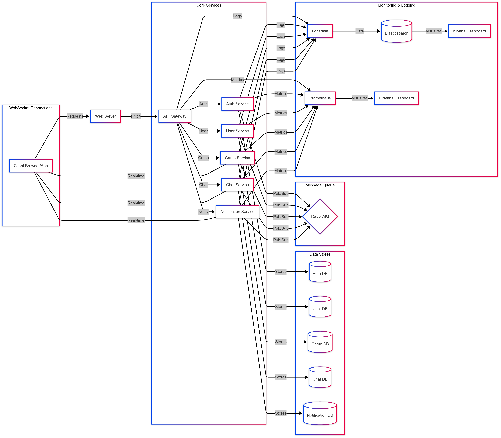

# Transcendence

## Architecture Overview

Our project follows a microservices architecture pattern with the following components:



The diagram above illustrates the following key components:
- Client-side application that communicates with our backend services
- Web Server and API Gateway for routing requests
- Core microservices (Auth, User, Game, Chat, Notification)
- Dedicated databases for each service
- Message queue (RabbitMQ) for inter-service communication
- WebSocket connections for real-time features
- Monitoring and logging infrastructure

## Development Workflow

We follow a feature branch workflow to ensure code quality and maintain a stable main branch. For detailed instructions on our Git workflow, please refer to:

[Git Workflow Documentation](docs/git-workflow.md)

Key points:
- Always create feature branches from main
- Keep branches focused on specific features or fixes
- Create pull requests for code review
- Squash commits when merging to main
- Delete feature branches after merging

## Shared Types

This section contains shared type definitions used across multiple services.

```typescript
// Add shared types here
```

## Services

### Auth Service
Authentication and authorization service.

### User Service
User profile management and social features.

### Game Service
Game logic, matchmaking, and state management.

### Chat Service
Real-time messaging and chat room functionality.

### Notification Service
User notifications and alerts.

## Getting Started

Instructions for setting up the development environment will be added here.

## Monitoring & Logging

Details about our ELK stack and Prometheus/Grafana monitoring.