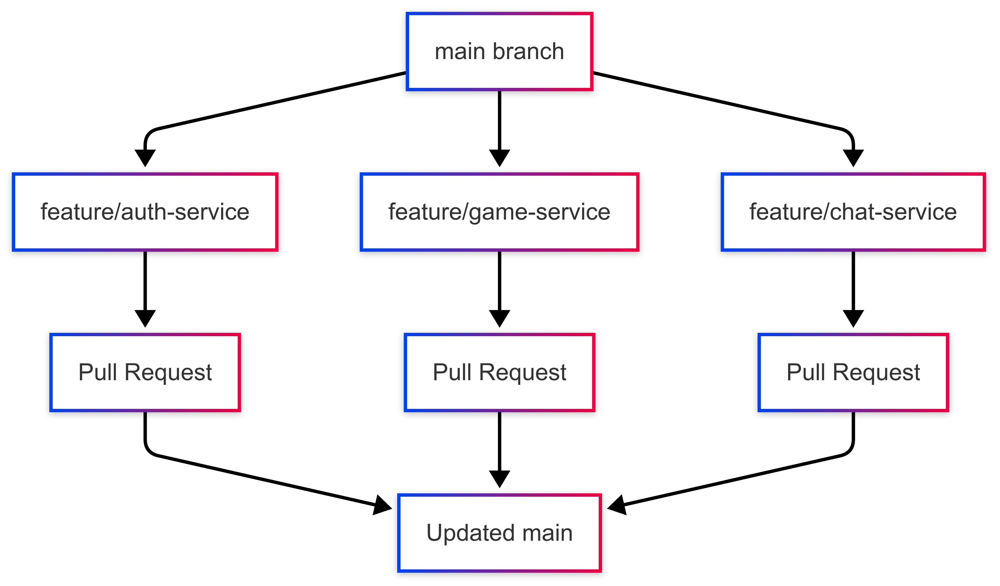

# Git Workflow for Team Development

## Feature Branch Workflow Overview

The feature branch workflow is a Git workflow that encourages developers to create a new branch for each feature or component they're working on. This approach keeps the main branch clean and deployable at all times.




## Step-by-Step Process

### 1. Start with an Updated Main Branch

```bash
# Make sure you're on main
git checkout main

# Get the latest changes
git pull origin main
```

### 2. Create a Feature Branch

```bash
# Create and switch to a new feature branch
git checkout -b feature/elk-stack-integration

# Naming conventions:
# feature/[feature-name]
# bugfix/[bug-description]
# hotfix/[issue-description]
```

### 3. Work on Your Feature

```bash
# Make changes to implement your feature
# For example, setting up ELK stack components

# Commit changes frequently with meaningful messages
git add docker-compose.elk.yml
git commit -m "Add initial Elasticsearch configuration"

git add logstash/pipeline/logstash.conf
git commit -m "Configure Logstash to collect service logs"
```

### 4. Keep Your Feature Branch Updated

```bash
# Regularly sync with main to avoid major conflicts
git checkout main
git pull origin main
git checkout feature/elk-stack-integration
git merge main

# Resolve any conflicts that arise
```

### 5. Prepare for Pull Request

```bash
# Push your feature branch to the remote repository
git push origin feature/elk-stack-integration

# If you've already pushed and made more changes:
git push origin feature/elk-stack-integration
```

## Protected Branches and Pull Requests

### Setting Up Protected Branches

Protected branches prevent direct pushes and ensure code quality through required reviews and checks. For the ft_transcendence project, protecting the main branch is essential.

#### How to Set Up Branch Protection (GitHub):

1. Go to your repository → Settings → Branches
2. Click "Add rule" next to "Branch protection rules"
3. Enter "main" in the branch name pattern
4. Configure these recommended settings:
   - ✅ Require pull request reviews before merging
   - ✅ Require approvals (at least 1-2 team members)
   - ✅ Dismiss stale pull request approvals when new commits are pushed
   - ✅ Require status checks to pass before merging
   - ✅ Require branches to be up to date before merging
   - ✅ Do not allow bypassing the above settings

#### Benefits of Protected Branches:

- Prevents accidental pushes to main
- Ensures code review happens for all changes
- Maintains a stable, always-deployable main branch
- Creates accountability and knowledge sharing
- Enforces your team's quality standards

### Creating Effective Pull Requests

Pull requests (PRs) are the primary way to merge code into protected branches. A good PR facilitates effective code review and documents the changes being made.

#### Creating a Pull Request:

1. Push your feature branch to the remote repository:
   ```bash
   git push origin feature/elk-stack-integration
   ```

2. Go to your repository on GitHub/GitLab
3. Click "New Pull Request" or "Compare & pull request"
4. Set base branch to `main` and compare branch to your feature branch
5. Add a descriptive title that summarizes the change

#### Writing an Effective PR Description:

```markdown
## ELK Stack Integration

This PR implements the ELK stack for centralized logging as required by the DevOps module.

### Problem
Describe the problem this PR solves. For example:
- We currently lack centralized logging for our microservices
- Troubleshooting issues across services is difficult
- We need better visibility into system behavior

### Solution
Explain your implementation approach:
- Added Elasticsearch configuration for log storage
- Configured Logstash pipelines for each service
- Set up Kibana dashboards for log visualization
- Added logging middleware for all services

### Testing
Describe how you've tested the changes:
- Verified log collection from all services
- Tested search functionality in Kibana
- Confirmed log retention policies
- Load tested with simulated traffic

### Screenshots
[Include screenshots of Kibana dashboards or other relevant visuals]

### Related Issues
Closes #123, Relates to #456
```

#### PR Review Process:

1. **Assign Reviewers**: Select team members familiar with the affected components
2. **Respond to Feedback**: Address all comments constructively
3. **Make Requested Changes**: Push additional commits to address feedback
4. **Re-request Review**: After addressing feedback, ask for another review
5. **Approval**: Once approved, the PR can be merged

#### Merging Options:

- **Squash and merge**: Combines all commits into one (recommended for cleaner history)
- **Rebase and merge**: Applies commits individually without a merge commit
- **Create a merge commit**: Preserves all commits and adds a merge commit

After merging, delete the feature branch to keep the repository clean.

### 7. Code Review Process

1. Assign team members to review your PR
2. Address feedback with additional commits
3. Use the PR discussion to clarify implementation details
4. Make requested changes until approval

### 8. Merging the Pull Request

1. Once approved, merge the PR (prefer "Squash and merge" for cleaner history)
2. Delete the feature branch after merging
3. Pull the updated main branch to your local repository

```bash
git checkout main
git pull origin main
```

## Best Practices for Microservices Projects

### 1. Service-Based Branches

For microservices architecture, consider organizing branches by service:

```
feature/auth-service/jwt-implementation
feature/game-service/real-time-updates
feature/chat-service/direct-messaging
feature/elk-stack/kibana-dashboards
```

### 2. Meaningful Commit Messages

Structure commit messages to clearly communicate changes:

```
feat(auth): Implement JWT token validation
fix(game): Resolve race condition in game state updates
docs(elk): Add ELK stack setup documentation
test(chat): Add unit tests for message filtering
```

### 3. Branch Protection Rules

Set up branch protection for `main`:
- Require pull request reviews before merging
- Require status checks to pass
- Prohibit direct pushes to main

### 4. CI/CD Integration

Integrate your Git workflow with CI/CD:
- Run tests automatically on PR creation
- Deploy feature branches to staging environments
- Verify ELK and Prometheus integration works

### 5. Documentation Updates

Always update documentation with code changes:
- Update API documentation when endpoints change
- Document new message queue topics
- Update monitoring dashboards for new metrics

### 6. Conflict Resolution Strategy

When conflicts occur:
1. Understand both changes before resolving
2. Communicate with the author of the conflicting code
3. Consider pair programming for complex conflict resolution
4. Test thoroughly after resolving conflicts

## Common Git Commands Reference

### Basic Commands

```bash
# Check status of your working directory
git status

# View commit history
git log
git log --oneline --graph --decorate

# Discard changes in working directory
git checkout -- <file>

# Unstage a file
git reset HEAD <file>
```

### Branch Management

```bash
# List all branches
git branch

# List remote branches
git branch -r

# Delete a branch locally
git branch -d <branch-name>

# Delete a branch remotely
git push origin --delete <branch-name>
```

### Advanced Operations

```bash
# Create a tag
git tag -a v1.0.0 -m "Version 1.0.0"

# Cherry-pick a commit
git cherry-pick <commit-hash>

# Stash changes
git stash
git stash pop

# Interactive rebase
git rebase -i HEAD~3
```

## Handling Specific Scenarios

### Reverting a Merged PR

```bash
# Find the merge commit
git log

# Create a revert commit
git revert -m 1 <merge-commit-hash>

# Push the revert
git push origin main
```

### Fixing a Bad Commit

```bash
# Amend the last commit
git commit --amend

# Force push (use with caution!)
git push origin <branch-name> --force-with-lease
```

### Creating a Hotfix

```bash
# Create hotfix branch from main
git checkout main
git checkout -b hotfix/critical-bug

# After fixing the issue
git push origin hotfix/critical-bug

# Create PR to main
```

## Team Collaboration Tips

### Communication During Development

- Announce when you start working on a feature to avoid duplicate work
- Share your branch early, even as a work-in-progress (WIP) PR
- Use PR comments to discuss implementation details
- Tag team members with @mentions for specific questions

### Code Review Etiquette

- Be respectful and constructive in comments
- Explain the "why" behind suggestions, not just the "what"
- Use GitHub's suggestion feature for small changes
- Acknowledge and thank reviewers for their feedback

### Handling Long-Running Branches

- Rebase frequently to stay current with main
- Consider breaking large features into smaller, incremental PRs
- Create checkpoint commits that can be easily referenced
- Document architectural decisions in the PR description

This workflow will help your team effectively collaborate on projects, ensuring that your components are developed in a structured and maintainable way. 